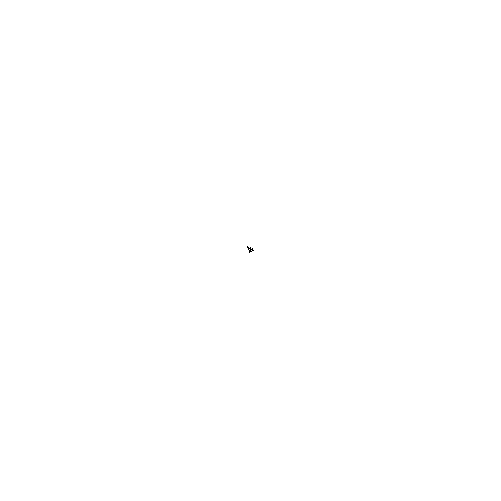
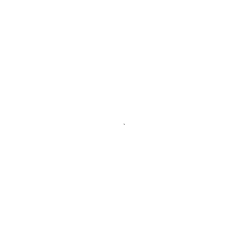

# Diffusion Limited Aggregation Simulation

Run:
`python dlasimulation.py dimension stickiness drift max_dist iteration folder_path`

Example: ``python dlasimulation.py 501 0.5 2 500 40000 'frames'``

* dimension - (integer) starting from 501. Dimension of Image or Field
* stickiness - (float) between 0 and 1. float) the stickiness factor which determines the probability of a particle aggregating
* drift - (float) greater than 0. the factor of drift towards the center. Higher the drift more strongly is the attraction to the center
* max_dist - (integer) represents the maximum allowed squared distance between 
the particle and the aggregated particles before the random walk begins.
 If greater the particle is regenerated
 
 ## Objects
 * [Particle](Particle.py) - A particle object performs the random walk. Assumption -  It can move in any of the four cardinal directions depending on the direction specified to it. 
 * [Field](Field.py) - Field / "Image" captures the particle movements and aggregation. The Field object allows certain customizations to the particle movements. Initially the field is empty with one particle at the center.
 * [DlaSimulation](dlasimulation.py) - DlaSimulation simulates the Diffusion Limited Aggregation and stores 
 images at regular intervals
 * [BinarySearchTree](BST.py) - The BinarySearchTree class is used to store the aggregated particles. It can find the nearest aggregated particle to a given particle. 
 
 ## [Simulation Results](simulation_results)
 * [sim1](simulation_results/sim1) - stickiness factor = 1, max_dist = 1000, iterations = 2000
 
 * [sim2](simulation_results/sim2) -  stickiness factor = 0.1, max_dist = 500, iterations = 2000
 
  * [sim3](simulation_results/sim3) -  stickiness factor = 0.05, max_dist = 500, iterations = 2000
 
   * [sim4](simulation_results/sim4) -  stickiness factor = 0.5, max_dist = 500, iterations = 3500
 
 
 
 ## Approaches
 ### Naive Approach 
  - The particle starts the random walk from the edge pixels
  - The particle moves to any of the four neighbouring pixels with equal probability.
 
 In this case the simulation is extremely slow. As the probability to reach the center pixel is negligible.
 
 ### Approach 2
   - The particle starts the random walk from the edge pixels
   - The particle moves randomly but in general drifts towards the center
   
 ### Approach 3
   - The particle starts from a random pixel at a certain "max_dist" away from the nearest aggregated particle.
   - The particles also starts at a minimum distance from the aggregated particles
   - The particle moves randomly but in general drifts towards the center
   
   To get the distance from the nearest aggregated particle, a binary search tree (BST) is used to store the aggregated particles. 
   For a given particle, the BST can get the nearest aggregated particle or the distance to the nearest aggregated particle.
   
   This enhances the speed of simulation, as the starting pixel of a particle is not too far away.  

 